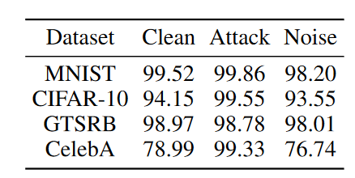

# BppAttack代码复现

原文链接：http://arxiv.org/abs/2205.13383

本文采用的数据集为CIFAR10，网络模型为Pre-activation ResNet18。

## 模型训练曲线

### Clean Accuracy

下图是在Pre-activation ResNet18网络下，利用干净的测试集样本训练模型，输入不同样本得到的准确率。

其中，Clean Accuracy_Bd的样本是输入样本为经过Image quantization和Dithering的图像转化的后门样本，Clean Accuracy_Clean的样本是干净样本，Clean Accuracy_Cross的样本是干净样本加上干扰（negative样本）。当训练step到达200后，三条曲线趋于稳定。其中Clean Accuracy_Clean比Clean Accuracy_Bd和Clean Accuracy_Cross高1个百分点。我们可以得到在干净样本上训练的模型，对干净样本的分类能力样要强于样本。

### Test Accuracy

下图是在Pre-activation ResNet18网络下，利用干净样本、后门样本和negative样本训练模型，输入不同样本得到的准确率。

上图中，当step训练到200次后，Test Accuracy_Bd为99.95999908447266，Test Accuracy_Clean为94.69999694824219。由上图我们不难得出当训练样本包括干净样本、后门样本和negative样本后，模型对后门样本的分类能力增强，但对于干净样本的分类能力下降。

## 后门攻击结果

下图，是训练epoch到达800次后，后门攻击成功的结果截图。

上图，从上到下，分别是干净样本，后门样本，干净样本、后门样本和negative样本三者组合，后门样本与干净样本的差异残差。我们可以从第4张得到，后门样本与干净样本残差很小。因此，我们可以得出结论，作者利用Dithering Image quantization和Dithering得到的后门样本难以被人眼分辨。，具有较好的隐蔽性。

## 结果对比

该文章的官方仓库代码基于https://github.com/VinAIResearch/Warping-based_Backdoor_Attack-release的代码。本人通篇读完BppAttack文章，文章中并无与官方仓库代码有类似结论。但官方仓库代码得出的结果与http://arxiv.org/abs/2102.10369文章中的一结果吻合。该文章在all-to-one配置下对后门模型进行了训练和测试，测试了clean mode, attack mode, and the noise mode，其结果如下。

其中在数据集CIFAR-10上的训练结果中的CLean和Attack样本的准确率与上文模型训练曲线中的Test Accuracy的结果十分相近。