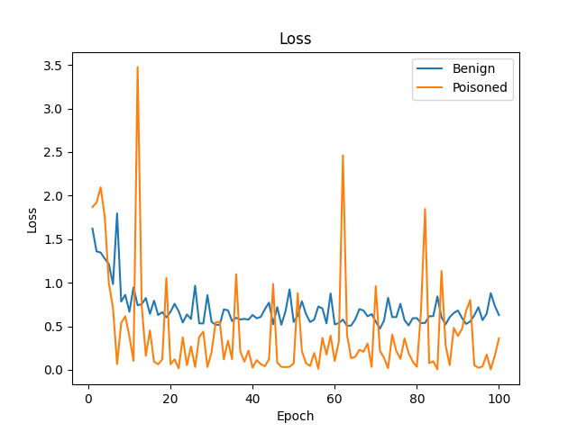
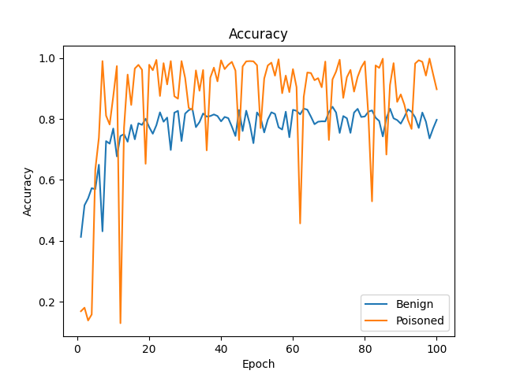

# WaNet代码复现

原文链接：http://arxiv.org/abs/2102.10369

复现代码使用数据集为CIFAR10,网络模型为ResNet18。

## 模型训练曲线

我进行了100轮训练，分别对干净样本和后门样本进行了识别mean loss和accuracy的检测。其结果如下图显示。

## mean loss

### accuracy

有上2图，我们不难看出对于resnet18网络，经过Image warping的后门样本，仍然能被分类器精准分类，甚至分类器对后门样本的分类准确率高于干净样本。这与原文中的ATTACK EXPERIMENTS结论一致。原文实验结论如下图所示。

## 后门攻击结果

### 训练集上采样的一份干净样本

### 训练集上采样的相应后门样本

### 测试集上采样的一份干净样本

### 测试集上采样的相应后门样本

有上述两对样本，我们不难看出，WaNet利用图像扭曲产生的后门样本与干净样本十分相近，这与文章的结论一致。在原文中的HUMAN INSPECTION，作者把干净图片和后门图片混合，对40个人进行了询问图片的真实性，WaNet产生的后门样本难以被人分辨真假，具有跟高的fooling rates。下图是作者的方法和以往后门攻击方法的fooling rates的对比。

